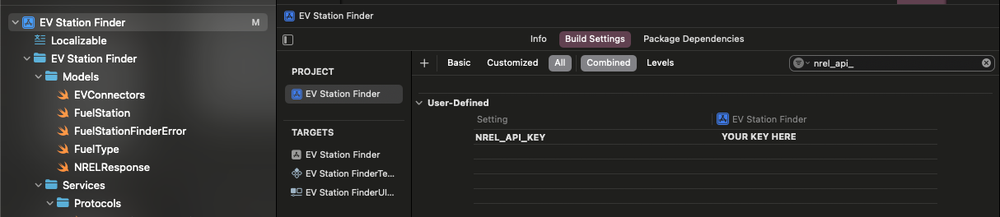

# EVStationFinder

## About
This project is an iOS app called "EV Station Finder" built using Swift and SwiftUI under the MVVM architecture. It is part of a Home Exercise.

Its main feature is to fetch and display electric vehicle (EV) charging stations using the NREL Alternative Fuel Stations API, but it was built with extensibility in mind: the code was structured in a way that is easy to extend to other types of fuel stations, or use a different API, etc.

## Instructions to set up and run the app 
1. Clone the repository:
```bash
   git clone https://github.com/przucato/EVStationFinder.git
 ```  

2. Open the project in Xcode 16 or later.

3. Sign up and retrieve your free API key from the NREL Developer Portal: https://developer.nrel.gov/docs/api-key/
 
4. With your API key in hands, use it to fill the NREL_API_KEY user-defined setting in the Build Settings of the project, as shown in the image:



5. Build and run the project on an iOS 15+ simulator or device.


## Project Architecture
The app follows the MVVM (Model-View-ViewModel) architecture to separate responsibilities:

- Model: Defines data structures such as FuelStation and decoding logic.

- View: SwiftUI components (EVStationSearchView, StationDetailView) that display the UI.

- ViewModel: Handles business logic (EVStationSearchViewModel, StationDetailViewModel); make use of services to perform operational tasks.

- Services: Perform tasks that have effect outside of the application or as part of an operational process.


The project uses protocol-oriented programming extensively, especially for services such as networking and data storage. This allows:

- Easy replacement of concrete implementations (e.g., swapping the real API service for a mock in tests).

- Simplified extension of functionalities (e.g., adding caching, logging, or retry logic).

- Improved testability and dependency injection.

This approach ensures that each component is decoupled and conforms to the Single Responsibility Principle, making the codebase scalable and easier to maintain.


## Completed levels for the Home Exercise
- ### Level 1: Core Functionality ✅
   Initial view of the app made with SwiftUI shows a text field for inserting a ZIP code, and only valid ZIP codes enable the Search button. A prompt will appear if the user types an invalid ZIP code, and the validator can be easily replaced in case we want to expand the app to use other formats of ZIP codes. 

   The NREL API endpoint GET /api/alt-fuel-stations/v1.json?fuel_type=ELEC&zip={zip_code}&api_key={API_KEY} is used to fetch fuel stations, which are showed on a List (API can be easily replaced).

   API errors are handled and friendly messages are shown to the user.

   The last used zip code is persisted in User Defaults (also easily replaced by other data storage services).
- ### Level 2: Testing the API response ✅
   Test case EVFuelStationFinderServiceTests created to test some API responses, specially for invalid ZIP codes.              
- ### Level 3: Detailed View of station ✅
   Tapping on a station will show a details screen. For electric vehicle charging stations, the types of available connectors are also shown.

   A button will open the station's address on Apple Maps.
- ### Level 4: Superstar Feature Map Integration
   Not implemented...